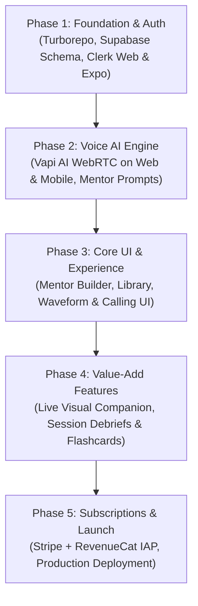

# Atlas — Project Plan

Voice-powered AI learning platform across **Web** and **Mobile** (iOS & Android), elevated with real-time visual companions, long-term memory, and automated session debriefs.

---

## 1. Product Vision & Value Proposition

- **Conversational Voice Learning:** Real-time, low-latency back-and-forth speech with customized AI mentors.
- **Cross-Platform Accessibility:** 
  - **Mobile (iOS & Android):** Ideal for on-the-go practice, commutes, walking, and hands-free tutoring.
  - **Web (Desktop/Tablet):** Ideal for deep study sessions, dashboard reviews, and visual-heavy learning (code/math).
- **Core Value-Adds beyond Standard Voice AI:**
  1. **Live Visual Companion:** Real-time streamed visual aids (LaTeX math formulas, syntax-highlighted code snippets, bullet points) synchronized with spoken audio.
  2. **Post-Session AI Debrief & Flashcards:** Automatic post-call summarization, knowledge gap identification, and Spaced-Repetition (Anki-style) flashcards.
  3. **Session Memory & Long-Term Context:** Vector embeddings (pgvector) of past discussions so mentors recall user progress and follow up in subsequent sessions.

---

## 2. Tech Stack

| Layer | Technology | Role |
|---|---|---|
| **Monorepo** | **Turborepo** | Monorepo orchestrator managing `web`, `app`, and `packages` |
| **Web & REST API** | **Next.js 15+ (App Router)** | Web dashboard + REST Route Handlers (`/api/*`) consumed by Web & Mobile |
| **State Management** | **Zustand** | Client-side state (call session, active mentor, user preferences) |
| **Mobile App** | **React Native / Expo** | iOS & Android native apps calling Next.js REST endpoints & WebRTC audio |
| **Voice Engine** | **Vapi AI** | Full-duplex speech-to-speech engine (Deepgram + LLMs + ElevenLabs/Cartesia) |
| **Database** | **MongoDB (Mongoose)** | Document store for users, mentors, sessions, and flashcards |
| **Authentication** | **Clerk** | Unified auth across Web and Mobile |
| **Monetization** | **Stripe** + **RevenueCat** | Stripe for Web; RevenueCat for iOS App Store & Google Play |

---

## 3. Architecture & Monorepo Structure

```
atlas/
├── web/                             # Next.js 15+ (Web UI + REST API Endpoints)
│   ├── app/
│   │   ├── (auth)/                  # Auth pages
│   │   ├── (dashboard)/             # Main dashboard
│   │   ├── api/                     # Shared REST Route Handlers
│   │   │   ├── auth/                # /api/auth/*
│   │   │   ├── mentors/             # /api/mentors/* (CRUD)
│   │   │   ├── sessions/            # /api/sessions/* (history, summaries)
│   │   │   ├── voice/               # /api/voice/* (tokens, webhooks)
│   │   │   └── flashcards/          # /api/flashcards/*
│   │   ├── layout.tsx
│   │   └── page.tsx
│   ├── lib/
│   │   ├── db/                      # Cached MongoDB / Mongoose connection
│   │   └── models/                  # Mongoose Schemas (Mentor, Session, User, Flashcard)
│   ├── stores/                      # Zustand state stores (useVoiceStore, useMentorStore)
│   └── components/                  # Web UI components
│
├── mobile/                          # Expo (React Native)
│   ├── app/                         # Expo Router file-based navigation
│   │   ├── (tabs)/                  # Tab screens (Home, Mentors, History, Profile)
│   │   ├── call/                    # Active voice call screen
│   │   └── _layout.tsx
│   ├── components/                  # Native UI components
│   ├── stores/                      # Mobile Zustand stores
│   ├── lib/
│   │   ├── api.ts                   # HTTP client calling Next.js REST endpoints
│   │   └── voice.ts                 # Vapi React Native / WebRTC integration
│   └── package.json
│
├── packages/
│   └── types/                       # Shared TypeScript interfaces & DTOs
│
├── turbo.json                       # Turborepo build pipeline
├── package.json                     # Root workspace configuration
└── README.md
```

---

## 4. Key Considerations: Web vs. Mobile

| Feature | Web Implementation | Mobile (iOS & Android) Implementation |
|---|---|---|
| **Voice / WebRTC** | `@vapi-ai/web` (Browser WebRTC) | `@vapi-ai/react-native` + Native WebRTC & microphone permissions |
| **Auth** | `@clerk/nextjs` (Cookie & middleware based) | `@clerk/clerk-expo` (SecureStore token caching) |
| **Audio in Background** | Browser tab active audio | Background Audio mode & CallKit / Foreground services |
| **Billing / Subscriptions** | Stripe Checkout / Customer Portal | Apple In-App Purchases & Google Play Billing via RevenueCat |

---

## 5. Execution Roadmap



### Phase Breakdown

- **Phase 1: Foundation & Auth**
  - Turborepo setup with shared `packages/api` and `packages/types`.
  - Supabase schema definition: `profiles`, `mentors`, `sessions`, `bookmarks`, `flashcards`.
  - Clerk authentication integration on both Web and Expo Mobile.

- **Phase 2: Voice AI Engine**
  - Integrate Vapi AI Web SDK on Next.js and Vapi React Native SDK on Expo.
  - Implement dynamic system prompt generator based on subject, topic, difficulty, and mentor teaching style.

- **Phase 3: Core UI & Experience**
  - Build Mentor Creation Studio (name, voice, subject, topic, personality).
  - Build Mentor Library with category filters and search.
  - Implement active calling screen with real-time waveform visualizers and call control buttons.

- **Phase 4: Visual Companion & Long-Term Memory**
  - Real-time visual cards synced with AI responses (code snippets, math formulas).
  - Automatic session summarization and flashcard generation after each call.
  - Long-term memory store using pgvector in Supabase.

- **Phase 5: Monetization & Production Launch**
  - Stripe integration on Web.
  - RevenueCat integration for Apple App Store and Google Play subscriptions.
  - Deployment pipelines (Vercel for Web, EAS Build / App Store / Play Store for Mobile).
